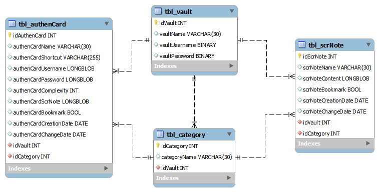

# Virtual Vault :: A password manager to store various passwords and organize of user login credentials

Author: Loan Lassalle
***

## Purpose

The ambition of this project is to create a program to archive and manage user authentication information in a secure manner.

## Objectives
* Create a secure space to store data
* Create a strengthened access system with a single password
* Archive and manage authentication information for different user accounts
* Develop a system to diversify and improve user passwords

## Relational model

